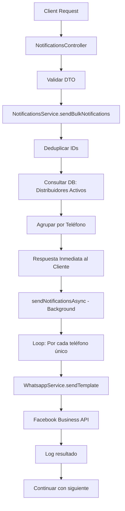

# 📬 Sistema de Notificaciones Masivas - Documentación Técnica

## 📋 Resumen de la Implementación

Este módulo implementa un sistema eficiente para enviar notificaciones masivas por WhatsApp a distribuidores usando plantillas de Facebook Business API.

## 🏗️ Arquitectura

```
src/notifications/
├── notifications.module.ts           # Módulo principal
├── notifications.controller.ts       # Controlador REST API
├── notifications.service.ts          # Lógica de negocio
├── whatsapp.service.ts               # Servicio de WhatsApp (existente)
└── dto/
    └── send-bulk-notifications.dto.ts # DTO de validación
```

---

## 🔧 Componentes Implementados

### 1. **NotificationsModule** 
```typescript
@Module({
  imports: [HttpModule, PrismaModule],
  providers: [WhatsappService, NotificationsService],
  exports: [WhatsappService, NotificationsService],
  controllers: [NotificationsController],
})
```

**Dependencias:**
- `HttpModule`: Para peticiones HTTP a WhatsApp API
- `PrismaModule`: Para consultas a la base de datos
- `WhatsappService`: Servicio existente de WhatsApp
- `NotificationsService`: Nuevo servicio de notificaciones

---

### 2. **NotificationsController**

**Endpoint:** `POST /notifications/send`

**Características:**
- ✅ Autenticación JWT requerida (`JwtAuthGuard`)
- ✅ Solo usuarios ADMIN (`RolesGuard + @Roles(Role.ADMIN)`)
- ✅ Documentación Swagger completa
- ✅ Validación de datos con DTOs

```typescript
@ApiTags('Notificaciones')
@Controller('notifications')
@UseGuards(JwtAuthGuard, RolesGuard)
@ApiBearerAuth()
```

---

### 3. **SendBulkNotificationsDto**

**Validaciones:**
```typescript
{
  distributorIds: string[];  // @IsArray, @ArrayMinSize(1), @IsString({ each: true })
  message: string;           // @IsString, @IsNotEmpty
}
```

**Ejemplo de request:**
```json
{
  "distributorIds": ["clxxxxx1", "clxxxxx2", "clxxxxx3"],
  "message": "Se le informa que tiene una nueva promoción disponible."
}
```

---

### 4. **NotificationsService**

#### Método Principal: `sendBulkNotifications()`

**Proceso de ejecución:**

1. **Deduplicación de IDs**
   ```typescript
   const uniqueDistributorIds = [...new Set(distributorIds)];
   ```

2. **Consulta de distribuidores activos**
   ```typescript
   const distributorsInfo = await this.prisma.distributor.findMany({
     where: {
       id: { in: uniqueDistributorIds },
       active: true,
     },
     select: {
       id: true,
       firstName: true,
       lastName: true, 
       socialReason: true,
       phone: true,
     },
   });
   ```

3. **Agrupación por teléfono**
   ```typescript
   const phoneGroups = new Map<string, DistributorInfo>();
   // Evita enviar múltiples mensajes al mismo número
   ```

4. **Procesamiento asíncrono**
   ```typescript
   this.sendNotificationsAsync(phoneGroups, message).catch(...)
   // No bloquea la respuesta al cliente
   ```

#### Método Privado: `sendNotificationsAsync()`

**Características:**
- ✅ Procesamiento secuencial para evitar rate limiting
- ✅ Uso de plantilla WhatsApp `notificaciones_distribuidores`
- ✅ Manejo individual de errores (continúa si uno falla)
- ✅ Logging detallado de todo el proceso

```typescript
await this.whatsappService.sendTemplate(
  phone,
  'notificaciones_distribuidores',
  [name, message],
);
```

---

## 📱 Plantilla WhatsApp

**Nombre:** `notificaciones_distribuidores`

**Parámetros enviados:**
1. **Nombre del distribuidor** (firstName || lastName || socialReason || 'Distribuidor')
2. **Mensaje personalizado** (del request body)

**Plantilla final:**
```
Notificación Importante
Hola, distribuidor/a [NOMBRE_DISTRIBUIDOR],
Le notificamos lo siguiente:
[MENSAJE_PERSONALIZADO]
Gracias
Nexus Soluciones
```

---

## 🔄 Flujo Completo



---

## 📊 Respuestas de la API

### ✅ Éxito
```json
{
  "success": true,
  "message": "Notificaciones en proceso para 25 distribuidores",
  "totalRequested": 30,
  "totalFound": 28,
  "uniquePhones": 25,
  "distributorsWithoutPhone": 3,
  "status": "processing"
}
```

### ❌ Sin distribuidores encontrados
```json
{
  "success": false,
  "message": "No se encontraron distribuidores activos",
  "totalRequested": 5,
  "totalFound": 0,
  "notificationsSent": 0,
  "notificationsFailed": 0,
  "distributorsWithoutPhone": 0
}
```

---

## ⚡ Optimizaciones Implementadas

### 1. **Eficiencia de Base de Datos**
- Una sola consulta con `{ in: uniqueDistributorIds }`
- Solo campos necesarios en el SELECT
- Filtrado por `active: true` a nivel de DB

### 2. **Deduplicación Múltiple**
- **Nivel 1:** IDs duplicados → `[...new Set(distributorIds)]`
- **Nivel 2:** Teléfonos duplicados → `Map<phone, distributor>`

### 3. **Procesamiento Asíncrono**
- Respuesta inmediata al cliente (no espera a que se envíen todos los WhatsApp)
- Procesamiento en segundo plano con `sendNotificationsAsync`
- Logs en tiempo real para monitoring

### 4. **Manejo Robusto de Errores**
- Fallo individual no afecta al resto
- Logging detallado de errores y éxitos
- Contadores de enviados vs fallidos

### 5. **Prevención de Spam**
- Un solo mensaje por número de teléfono
- Validación de números antes del envío
- Rate limiting natural por procesamiento secuencial

---

## 🛡️ Seguridad

### 1. **Autenticación**
```typescript
@UseGuards(JwtAuthGuard, RolesGuard)
@ApiBearerAuth()
```

### 2. **Autorización**
```typescript
@Roles(Role.ADMIN)
```

### 3. **Validación de Entrada**
```typescript
@IsArray()
@ArrayMinSize(1)
@IsString({ each: true })
distributorIds: string[];

@IsString()
@IsNotEmpty()
message: string;
```

---

## 📝 Logging

**Logs implementados:**

1. **Inicio del proceso**
   ```
   Iniciando envío de notificaciones a X distribuidores
   ```

2. **Progreso**
   ```
   Se encontraron X números únicos para notificar
   ```

3. **Éxito individual**
   ```
   Notificación enviada a [Nombre] (593xxx) - [ID]
   ```

4. **Error individual**
   ```
   Error enviando notificación al distribuidor [ID] (593xxx): [Error]
   ```

5. **Resumen final**
   ```
   Proceso de notificaciones completado: X enviadas, Y fallidas
   ```

6. **Advertencias**
   ```
   Distribuidor [ID] no tiene teléfono registrado
   ```

---

## 🧪 Testing

### Request de prueba
```bash
curl -X POST "http://localhost:3000/notifications/send" \
  -H "Authorization: Bearer YOUR_JWT_TOKEN" \
  -H "Content-Type: application/json" \
  -d '{
    "distributorIds": ["clXXX1", "clXXX2"],
    "message": "Mensaje de prueba desde API"
  }'
```

### Casos de prueba recomendados

1. **✅ Caso normal**
   - Múltiples distribuidores activos
   - Todos con teléfono
   - Mensaje válido

2. **✅ Deduplicación**
   - IDs duplicados en la lista
   - Distribuidores con el mismo teléfono

3. **⚠️ Casos edge**
   - Distribuidores sin teléfono
   - Distribuidores inactivos
   - IDs que no existen

4. **❌ Casos de error**
   - Array vacío de IDs
   - Mensaje vacío
   - Token inválido
   - Usuario sin permisos ADMIN

---

## 🔗 Integración con WhatsappService

El `NotificationsService` utiliza el `WhatsappService` existente:

```typescript
await this.whatsappService.sendTemplate(
  phone,                              // Número formateado
  'notificaciones_distribuidores',    // Plantilla FB
  [name, message],                    // Parámetros [distributor_name, custom_message]
);
```

**Dependencias del WhatsApp Service:**
- Variables de entorno: `WHATSAPP_API_TOKEN`, `WHATSAPP_PHONE_ID`
- Solo envía en `ENVIRONMENT === 'production'`
- Formateo automático de números ecuatorianos
- Rate limiting y error handling ya implementado

---

## 📈 Métricas y Monitoreo

**Información devuelta en cada request:**
- `totalRequested`: IDs enviados en el request
- `totalFound`: Distribuidores activos encontrados
- `uniquePhones`: Números únicos a notificar
- `distributorsWithoutPhone`: Sin número registrado

**Logs para análisis:**
- Tiempo de procesamiento por lote
- Tasa de éxito/fallo por envío
- Distribuidores problemáticos (sin teléfono, inactivos)

Esta implementación está lista para producción y optimizada para el manejo eficiente de notificaciones masivas. 🚀